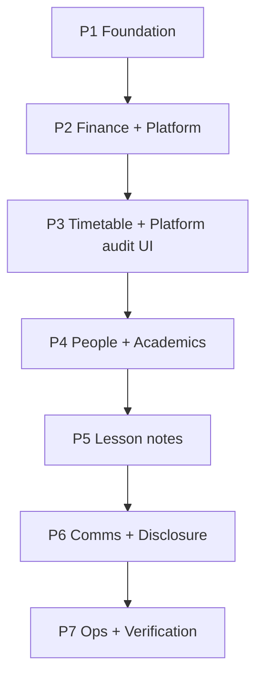

# EduSentrix Audit Hardening — Build Strategy

> **Companion to:** [EDUSENTRIX_AUDIT_HARDENING_SPEC.md](./EDUSENTRIX_AUDIT_HARDENING_SPEC.md) (v1.1)  
> **Purpose:** Executable phases, dependencies, exit gates, and ownership so implementation matches the spec without unbounded scope creep.

---

## Principles

1. **Spec is law** — Tiers, dual-write rules, prohibited payloads, hash-chain concurrency, and test layers in §10.13 are non-negotiable for “done.”
2. **No big-bang** — Ship vertical slices per phase; keep API responses and domain behavior stable (§2.3, §16).
3. **Foundation before surfaces** — `AuditEvent`, policy, writers, and tests land before most UI.
4. **Dual-write + reconcile** — Any critical domain that gets `AuditEvent` also gets tests + reconciliation coverage for that domain in the same phase (§4.9, §7.6).

---

## Phase map (execution order)

| Phase | Spec ref | Theme | Primary outcome |
|-------|----------|--------|-----------------|
| **P1** | §14 Phase 1, §16 items 1–7 | Foundation | Model, policy, writers, request context, hash chain, validation |
| **P2** | §14 Phase 2 | Finance + platform | Payments, billing owner / payment setup, subscriptions, applications + dual-write + reconciliation |
| **P3** | §14 Phase 3 | Timetable + governance | Timetable dual-write, `/platform/audit`, tighten deletes on authoritative records |
| **P4** | §14 Phase 4 | People + academics | Students, teachers, guardians, attendance, grades, reports |
| **P5** | §14 Phase 5 | Lesson notes + teacher | Lesson notes, escalations, official notices |
| **P6** | §14 Phase 6 | Communication + disclosure | Bulk email, exports, inbox, unmask |
| **P7** | §14 Phase 7 | Alerts + integrity | Hash verification jobs, anomaly alerts, dead-letter UX, drift reporting |

---

## P1 — Foundation (thorough checklist)

**Deliverables**

- [x] `src/models/AuditEvent.ts` — schema, indexes per §8.1–8.2
- [x] `src/models/AuditStreamHead.ts` — serialized `streamKey` head for §7.7
- [x] `src/lib/audit/policy.ts` — `AUDIT_ACTION_POLICIES`, `getAuditPolicy`, idempotency + payload budgets
- [x] `src/lib/audit/request-context.ts` — normalized context (actor, tenant, correlation, no user §10.11)
- [x] `src/lib/audit/hash-chain.ts` — genesis, canonical payload hash; append in `appendAuditStreamEvent.ts`
- [x] `src/lib/audit/validateAuditPayload.ts` — prohibited fields, size, required reason/before-after
- [x] `src/lib/audit/writeTransactionalAuditEvent.ts` — Tier 0, session-bound, throws on failure
- [x] `src/lib/audit/writeRetryableAuditEvent.ts` — Tier 1, bounded retry + dead-letter + `registerAuditAlert`
- [x] `src/lib/audit/registerAuditAlert.ts` — structured alert hook (wire to logging/monitoring later)
- [x] `src/lib/audit/deriveActivityFeed.ts` — stub for Activity mirror (wire in P2+)
- [x] Unit tests: `tests/audit.*.test.ts` (policy, hashing, validation)
- [ ] Integration tests (Mongo harness): Tier 0 rollback, stream contention retry

**Exit gate**

- Policy rejects oversized / prohibited payloads.
- Tier 0 writer requires `session` when policy tier is 0.
- Hash append is **not** naive read-then-write without contention handling (§7.7).

**Explicitly not in P1**

- Full outbox worker UI (P7 completes operational story).
- Wiring every route (starts P2).

---

## P2 — Financial + platform hardening

**Domains (dual-write)**

- Platform applications (`ApplicationAudit` + `AuditEvent`)
- Payment flows (`PaymentAuditEvent` + `AuditEvent`)
- Billing owner / payment setup
- Subscription admin actions

**Started (dual-write wired)**

- `POST /api/platform/applications` (public submit) → `application.submitted` + `recordApplicationAudit` + `writeRetryableAuditEvent` (`buildPublicApplicationFormAuditContext`)
- `POST /api/platform/applications/[id]/approve` → `application.approved` + `recordApplicationAudit`
- `POST /api/platform/applications/[id]/reject` → `application.rejected` + `recordApplicationAudit`
- `POST /api/admin/fees/payments/[id]` (`approve_proof` / `reject_proof` / `reverse`) → `payment.proof_*` / `payment.reversed` + `PaymentAuditEvent`
- `POST /api/admin/fees/payments` (create) → `payment.recorded` (+ `payment.duplicate_override.accepted` when applicable) + `PaymentAuditEvent`
- `POST /api/webhooks/paystack` (fee `charge.success` with invoice metadata) → `payment.recorded` + `PaymentAuditEvent` (`actorType: webhook`)
- `PATCH /api/admin/settings/payment-setup` → `billing.payout_account.updated` in the **same Mongo transaction** as `school.save()`
- `PATCH /api/platform/schools/[id]/subscription` → subscription lifecycle `AuditEvent` in the **same** transaction as `SchoolSubscription` + `SubscriptionEvent`
- Helpers: `fromApiRoute` adds `buildFinanceStaffAuditContext`, `buildPaystackWebhookAuditContext`, `buildPublicApplicationFormAuditContext`, `resolveFinanceActorRole`
- New policy usage: `payment.recorded`, `payment.duplicate_override.accepted`, `billing.payout_account.updated`, `subscription.*`, `application.submitted`

**Per route**

1. Map domain event → `actionCode` + policy tier.
2. Dual-write in same transaction where Tier 0 (§5.1, §10.9 Pattern A).
3. Idempotency key on externally replayable routes (§4.11, §9.5).
4. Route-level integration test: domain doc + `AuditEvent` both present.

**Exit gate**

- Reconciliation job or script exists for payments + applications (§7.6) with alerts on drift — `npm run audit:reconcile` (`scripts/audit-reconcile.ts` + `reconcileDomainAuditParity`).
- Tier 0 failure behavior documented for each new route (§10.10).

---

## P3 — Timetable + governance

**Deliverables**

- Timetable critical actions → dual-write to `AuditEvent` (keep `TimetableChangeLog`) — `publishTimetableVersion` accepts optional `auditContext`; `POST /api/admin/timetable/versions/:versionId/publish` passes `buildSchoolUserAuditContext` (`timetable.version.archived` / `timetable.version.published` in the same transaction as change logs when publish runs).
- Implement `/platform/audit` (§11.1) using shared primitives (§11.6) — `GET /api/platform/audit` + `src/app/(app)/platform/audit/page.tsx`.
- Remove or narrow delete paths so Tier 0/1 records are not user-deletable (Appendix B).

**Exit gate**

- Platform audit page reads normalized events with filters (§11.7 contract).
- Navigation to `/platform/audit` is real, not dead.

---

## P4 — People + academic records

**Deliverables**

- Student / teacher / guardian mutations, attendance, grade publish + post-publish edits, report secure download → Tier 0/1 as per §6 and §5.

**Started (dual-write wired)**

- `PATCH /api/teacher/attendance/homeroom/[date]` — `attendance.marked` in the same Mongo transaction as `StudentAttendance.bulkWrite` (before/after per student row, target `ClassGroup` + `AcademicPeriod`, stream `school:<id>:academics`).
- `PATCH /api/admin/students/[id]` — `student.record.updated` for GES identifier fields in the same transaction as `Student` update (stream `school:<id>:academics`).
- `POST /api/teacher/gradebook/[classGroupId]/[subjectId]/publish` — `grade.published` in the same transaction as `SubjectGrade.bulkWrite` + `Assessment` graded-at update (per-student totals/letters in before/after, target `ClassGroup` + `Subject`, stream `school:<id>:academics`).
- `POST /api/admin/teachers/[id]/activate` and `POST .../deactivate` — `teacher.status.updated` with stream `school:<id>:identity`.
- `GET /api/parent/reports/download` — `report.downloaded.secure` (Tier 1 / `writeRetryableAuditEvent`, stream `school:<id>:academics`; PDF still returned if audit exhausts retries — log only).
- `POST /api/admin/students/[id]/guardians` — `guardian.linked` after `Guardian.save()` (Tier 1, stream `school:<id>:identity`; failures logged, guardian row retained).
- Policy: `student.record.updated`, `teacher.status.updated`, `guardian.linked`; `report.downloaded.secure` is Tier **1** (retryable disclosure).

**Exit gate**

- Entity timelines on detail pages use shared drawer + DTO (§4.10, §11.6).

---

## P5 — Lesson notes + teacher workflows

**Deliverables**

- Lesson note review chain, escalations, official publication paths → `AuditEvent` + domain logs.

**Started (dual-write wired)**

- `POST /api/teacher/lesson-notes/[id]/approval` — transactional `AuditEvent` for `lesson_note.review_requested` (submit), `lesson_note.approved`, `lesson_note.rejected` (with `reason`), `lesson_note.returned_to_draft`; stream `school:<id>:academics`; actor roles `teacher` / `school_admin` / `journal_reviewer`.
- `PATCH /api/admin/lesson-notes/[id]/comments/[commentId]` — `lesson_note.comment_resolved` when a review comment moves to **resolved** (same transaction as comment update).

**Exit gate**

- Reason codes captured where policy requires (§4.7).

---

## P6 — Communication + disclosure

**Deliverables**

- Bulk email, exports, sensitive reads/unmask → audit + read events as spec’d.

**Started (dual-write wired)**

- `POST /api/admin/email/bulk` — `email.bulk.sent` (Tier 1) after `createEmailBatch` succeeds; metadata only (subject trim, counts, template key); stream `school:<id>:communication`; failures logged, batch still created.
- `GET /api/admin/students/export` — `export.generated` (Tier 1) with `exportKind: students_csv`, row count, filename; stream `school:<id>:exports`; failures logged, CSV still returned.
- `POST /api/admin/settings/payment-setup/unmask` — `data.unmasked` (Tier 0) after a finance user submits a **reason**; returns full payout account digits only when the transactional audit append succeeds; `GET /api/admin/settings/payment-setup` no longer returns raw account numbers when a value is on file (masked + `hasAccountNumberOnFile` until reveal). Stream `school:<id>:finance`.
- Policy: `export.generated` registered; `email.bulk.sent` unchanged (already in registry); `data.unmasked` already registered.

**Exit gate**

- Unmask generates its own audit event (§15 acceptance).

---

## P7 — Alerts + tamper evidence operations

**Deliverables**

- Scheduled hash-chain verification (sample or full).
- Dead-letter queue visibility for Tier 1.
- Reconciliation dashboards / reports for operators.
- Alert wiring for §10.12 (drift, dead letters, hash conflicts).

**Exit gate**

- §15 acceptance criteria fully satisfied.

---

## Cross-cutting workstreams

| Workstream | When |
|------------|------|
| **Action code catalog expansion** | Every phase; register new codes in `policy.ts` |
| **Backfill** | After P2 stabilizes for a domain (§13) |
| **Performance** | Index review after P3 (heavy reads on `AuditEvent`) |
| **Docs for on-call** | Per Tier 0 route as shipped (§10.10) |

---

## Dependency graph (simplified)

---

## Definition of done (global)

Aligned with §15:

- Every §6 action has a policy entry and stable `actionCode`.
- Tier 0 / 1 behaviors match §5 and §10.9.
- No prohibited payload storage without policy exception (§9.3).
- Tests cover §10.13 layers for shipped code paths.
- Dual-write domains have reconciliation + tests before calling the phase “closed.”

---

## How to use this with AI agents

1. Point the agent at **this file** for phase scope and **the main spec** for field-level rules.
2. One phase per large PR when possible; always include tests with behavior changes.
3. Never skip policy registration when adding a new audited action.
