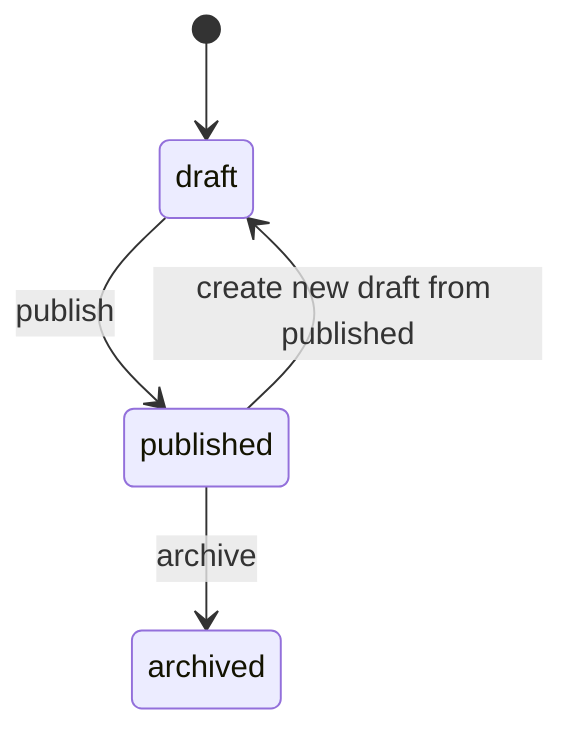

# Master Timetable Reboot Specification v1.0

## 1. Objective

Rebuild the master timetable into a reliable, conflict-aware, versioned scheduling system where:

1. **Class-group timetable is the source of truth** — Each class group has its own timetable created from the class detail page.
2. **Creation workflow** — Admin picks a day, picks a period, adds subject, duration, and teacher. Repeats until the week is complete.
3. **Master timetable is read-only** — No direct scheduling. It aggregates and displays all class-group timetables.
4. **Downstream views derive from class timetables** — Teacher page shows where they teach and when; student page shows their class timetable; parent page shows ward's timetable.
5. Preserves existing functionality during rollout.

## 2. Scope

1. Admin timetable management experience for draft, review, conflict resolution, and publish.
2. Timetable data model and APIs for week/day/calendar retrieval.
3. Centralized validation engine for teacher/class conflicts.
4. Read-only timetable surfaces:
   - Teacher detail page (`My Week`)
   - Class detail page (`Class Timetable`)
   - Parent portal (`Ward Week/Day`)
   - Student portal (`My Week/Day`)
5. Migration from current assignment-embedded schedules to a dedicated timetable domain.

## 3. Out of Scope (v1)

1. Independent room management module.
2. Timetable editing by teachers, parents, students, or class-level non-admin users.
3. AI auto-scheduling.
4. Cross-school timetable sharing.

## 4. Locked Product Decisions

1. `Room` in v1 means class classroom only.
2. Classroom label examples:
   - `JHS 1B Classroom`
   - `Primary 4A Classroom`
3. Classroom source rule:
   - First preference: `ClassGroup.defaultRoomName`
   - Fallback: generated label from grade + class name + `Classroom`
4. Required views:
   - Weekly view
   - Day view
   - Calendar (month) view for date navigation
5. Day view behavior:
   - Selecting Monday must show all Monday slots sorted by time.
6. Read-only views for:
   - Teacher (`My Week`)
   - Class
   - Parent (per ward)
   - Student (`My Week`)

## 5. Terminology

1. **Slot**: One scheduled lesson block for a class, subject, teacher, and time range.
2. **Classroom (v1)**: The class's own room label, not a standalone allocatable room entity.
3. **Draft Timetable**: Editable, unpublished timetable version.
4. **Published Timetable**: Active timetable visible to role-based read-only views.
5. **Conflict**: Scheduling violation detected by validation rules.
6. **Week View**: Monday-Friday (or configured weekdays) grid/list for one week.
7. **Day View**: Time-ordered list of all slots for one selected date/day.
8. **Calendar View**: Month calendar used to navigate to day/week schedule.

## 6. Existing Baseline and Compatibility Rules

1. Current master timetable route remains functional during transition.
2. Existing assignment flows continue to work while new timetable model is introduced.
3. Existing `TeacherAssignment.schedule` and `TeacherAssignment.schedules` remain supported until cutover.
4. Existing class and teacher schedule pages remain available until new planner is stable.
5. No destructive schema changes in v1 rollout.

## 7. High-Level Architecture

1. `Timetable Domain Service`:
   - Slot validation
   - Conflict detection
   - Publish/rollback orchestration
2. `Timetable Version Store`:
   - Draft and published versions per school + academic period
3. `Timetable Read APIs`:
   - Week/day/calendar queries
   - Role-scoped read access
4. `Timetable Admin APIs`:
   - Draft mutations
   - Conflict preview
   - Publish
5. `Audit and Activity`:
   - Change logs with actor and before/after payloads

## 8. Data Model (New + Additive)

### 8.1 TimetableVersion (new)

```ts
type TimetableVersionStatus = "draft" | "published" | "archived";

interface TimetableVersion {
  _id: ObjectId;
  schoolId: ObjectId;
  academicPeriodId: ObjectId;
  name: string;
  status: TimetableVersionStatus;
  baseVersionId?: ObjectId | null;
  publishedAt?: Date | null;
  createdBy: ObjectId;
  updatedBy: ObjectId;
  lockVersion: number;
  createdAt: Date;
  updatedAt: Date;
}
```

### 8.2 TimetableSlot (new)

```ts
interface TimetableSlot {
  _id: ObjectId;
  schoolId: ObjectId;
  academicPeriodId: ObjectId;
  versionId: ObjectId;

  classGroupId: ObjectId;
  gradeId: ObjectId;
  subjectId: ObjectId;
  teacherId: ObjectId;

  dayOfWeek: 0 | 1 | 2 | 3 | 4 | 5 | 6;
  startTime: string; // HH:MM, school local time
  endTime: string;   // HH:MM, school local time

  classroomLabel: string; // v1 canonical room representation
  source: "manual" | "imported" | "assignment_sync";

  createdBy: ObjectId;
  updatedBy: ObjectId;
  createdAt: Date;
  updatedAt: Date;
}
```

### 8.3 TimetableConflict (new)

```ts
type TimetableConflictCode =
  | "TEACHER_OVERLAP"
  | "CLASS_OVERLAP"
  | "INVALID_TIME_RANGE"
  | "MISSING_TEACHER"
  | "MISSING_SUBJECT"
  | "MISSING_CLASSGROUP"
  | "MISSING_CLASSROOM_LABEL"
  | "OUTSIDE_PERIOD_RANGE";

interface TimetableConflict {
  _id: ObjectId;
  schoolId: ObjectId;
  academicPeriodId: ObjectId;
  versionId: ObjectId;
  code: TimetableConflictCode;
  severity: "error" | "warning";
  slotIds: ObjectId[];
  message: string;
  metadata?: Record<string, unknown>;
  status: "open" | "resolved" | "ignored";
  createdAt: Date;
  updatedAt: Date;
}
```

### 8.4 TimetableChangeLog (new)

```ts
interface TimetableChangeLog {
  _id: ObjectId;
  schoolId: ObjectId;
  academicPeriodId: ObjectId;
  versionId: ObjectId;
  action: "slot_created" | "slot_updated" | "slot_deleted" | "published" | "archived";
  actorId: ObjectId;
  entityId?: ObjectId | null;
  before?: Record<string, unknown> | null;
  after?: Record<string, unknown> | null;
  createdAt: Date;
}
```

### 8.5 Additive Mapping Rule for Classroom

1. Continue reading `ClassGroup.defaultRoomName`.
2. If null/empty, generate classroom as:
   - `${grade.name} ${classGroup.name} Classroom`.
3. `roomId` remains optional legacy metadata and is not required by v1 rules.

## 9. Validation and Conflict Engine

### 9.1 Mandatory Validations

1. `startTime` and `endTime` must be valid `HH:MM`.
2. `endTime` must be after `startTime`.
3. `teacherId`, `subjectId`, `classGroupId`, and `gradeId` must belong to same school.
4. `gradeId` must match `classGroup.gradeId`.
5. `classroomLabel` must be non-empty.

### 9.2 Conflict Rules

1. Teacher overlap:
   - Same teacher, same day, overlapping time ranges is invalid.
2. Class overlap:
   - Same class, same day, overlapping time ranges is invalid.
3. Publish is blocked when unresolved `error` conflicts exist.

### 9.3 Time Overlap Formula

1. Two slots overlap if:
   - `slotA.start < slotB.end` and `slotB.start < slotA.end`.

## 10. Timetable Lifecycle

### 10.1 Status Flow



### 10.2 Publish Rules

1. Exactly one published version per school + academic period.
2. Publishing is atomic:
   - New version becomes published.
   - Previously published version becomes archived.
3. Role-facing read-only views always consume published version only.

## 11. API Specification (Proposed)

### 11.1 Admin Planner APIs

1. `GET /api/admin/timetable/versions?academicPeriodId=...`
2. `POST /api/admin/timetable/versions` (create draft)
3. `POST /api/admin/timetable/versions/:versionId/clone-from-published`
4. `POST /api/admin/timetable/versions/:versionId/publish`
5. `GET /api/admin/timetable/versions/:versionId/conflicts`
6. `POST /api/admin/timetable/versions/:versionId/conflicts/recompute`

### 11.2 Slot CRUD (Draft Only)

1. `GET /api/admin/timetable/versions/:versionId/slots`
2. `POST /api/admin/timetable/versions/:versionId/slots`
3. `PATCH /api/admin/timetable/versions/:versionId/slots/:slotId`
4. `DELETE /api/admin/timetable/versions/:versionId/slots/:slotId`

### 11.2a Class-Group Slot APIs (Primary Creation Path)

Slots are created from the class detail page. These endpoints ensure a draft version exists and scope slots to the class.

1. `GET /api/admin/classes/:classId/timetable/slots?academicPeriodId=...` — List draft slots for this class.
2. `POST /api/admin/classes/:classId/timetable/slots` — Create slot. Body: `{ academicPeriodId, dayOfWeek, startTime, endTime, subjectId, teacherId }`. Backend gets/creates draft, then creates slot with `classGroupId = classId`.
3. `PATCH /api/admin/classes/:classId/timetable/slots/:slotId` — Update slot (only if it belongs to this class).
4. `DELETE /api/admin/classes/:classId/timetable/slots/:slotId` — Delete slot (only if it belongs to this class).

### 11.3 Read APIs (Published Version)

1. `GET /api/timetable/week?date=YYYY-MM-DD&scope=school|class|teacher|student`
2. `GET /api/timetable/day?date=YYYY-MM-DD&scope=school|class|teacher|student`
3. `GET /api/timetable/calendar?month=YYYY-MM&scope=school|class|teacher|student`

### 11.4 Role-Specific Read Endpoints (Optional Facade Layer)

1. `GET /api/admin/teachers/:teacherId/timetable/week`
2. `GET /api/admin/classes/:classId/timetable/week`
3. `GET /api/parent/wards/:studentId/timetable/week`
4. `GET /api/student/timetable/week`

All role endpoints are read-only in v1.

## 12. Frontend Specification

### 12.1 Class-Group Timetable Editor (Primary Creation Flow)

**Location:** Class detail page → Schedule tab (`/admin/classes/:classId?tab=schedule`)

**Workflow:**
1. Select academic period (default: current).
2. For each day (Monday–Friday):
   - For each period (Period 1, Period 2, … from school settings, or custom):
     - Add subject, duration, teacher.
     - Optionally use period preset times from `SchoolSettings.periodSlots`.
3. Save slots to draft version. Slots are scoped to this class group.
4. Edit/delete existing slots inline.

**Features:**
- Day selector (Mon–Fri).
- Period selector or custom start/end time.
- Subject, teacher dropdowns; duration input.
- Inline edit/delete of existing slots.
- Link to master timetable for school-wide view and publish.

### 12.2 Admin Timetable Center (Read-Only Aggregation)

Route: `/admin/timetable`

**No direct scheduling.** This is a read-only dashboard.

Views:
1. `Week View` — Aggregated school-wide weekly schedule; filters: grade, class, teacher, subject.
2. `Day View` — Selected day schedule; sorted by start time.
3. `Calendar View` — Month grid; clicking a date opens day view.
4. `Conflicts Panel` — Open conflicts with type and quick navigation.
5. `Version Banner` — Current draft/published status; Publish action.
6. **Quick link** — "Edit in Class Schedule" when viewing a class's slots, navigates to class detail schedule tab.

### 12.4 Teacher Detail Page

1. Add read-only tab: `My Week`.
2. Supports week/day toggle.
3. Shows teacher's own slots (which class they're at and when) from published timetable.
4. Data derived from class-group timetables where teacherId matches.

### 12.5 Parent Portal

1. Add ward timetable read-only section.
2. Supports ward switcher for multi-child parents.
3. Supports week/day toggle per ward.

### 12.6 Student Portal

1. Add read-only `My Week` (and day) timetable section.
2. Shows student's class timetable from published version.

### 12.7 Empty, Loading, and Error States

1. No published timetable:
   - Show clear message and expected admin action.
2. No slots for selected day:
   - Show empty day message.
3. Load state:
   - Skeleton slots and calendar placeholders.
4. Error state:
   - Retry option and non-technical message.

## 13. Access Control and Safety

1. Admin roles with timetable permission can edit drafts and publish.
2. Teachers, students, parents, and class role consumers are read-only.
3. Parent can only read timetables for linked wards.
4. Student can only read own timetable.
5. Audit every admin write and publish action.

## 14. Performance and Limits

1. Target p95 read latency:
   - Day/week queries under 500ms for normal school sizes.
2. Target publish validation runtime:
   - Under 10s for up to 10,000 slots.
3. API pagination for large slot lists:
   - `page`, `limit`, `sort`, `filters`.
4. Max write batch size for bulk slot import:
   - 500 slots per request in v1.

## 15. Migration and Rollout Plan

### 15.1 Phase A: Foundation

1. Add new timetable collections and indexes.
2. Build read APIs from new tables.
3. Backfill draft from existing `TeacherAssignment.schedules`.

### 15.2 Phase B: Dual-Write

1. Keep current schedule edits.
2. Mirror edits to draft timetable tables.
3. Validate data parity between old and new projections.
4. Expose admin parity monitoring endpoint:
   - `GET /api/admin/timetable/parity`
   - Supports `academicPeriodId`, `versionId`, and `maxExamples`
   - Reports expected vs actual `assignment_sync` slot parity and mismatch examples.

### 15.3 Phase C: Admin UI Cutover

1. Enable new admin timetable center behind feature flag.
2. Publish from versioned workflow.
3. Keep legacy page as fallback read-only.
4. Make teacher `Assignments` tab schedule read-only:
   - No schedule create/edit in assignment tab
   - Schedule management is done in timetable planner only
   - Assignment tab displays projected slot schedules from class-group timetable data

### 15.5 Assignment Schedule Source Rule

1. Primary source:
   - Timetable slots from preferred version per academic period (`draft` first, else `published`).
2. Legacy fallback:
   - Use `TeacherAssignment.schedule/schedules` only when no timetable slots are available.
3. Consistency rule:
   - Subject assign/unassign routes must participate in dual-write so timetable projection remains current.
4. API deprecation rule:
   - `PATCH /api/admin/teacher-assignments/:id/schedule` no longer accepts schedule writes.
   - Assignment-level schedule edits must be done in the timetable planner.

### 15.4 Phase D: Role Read-Only Rollout

1. Enable teacher `My Week` tab.
2. Enable class read-only tab.
3. Enable parent ward timetable.
4. Enable student read-only `My Week`.

## 16. Testing Strategy

1. Unit tests:
   - Time validation
   - Overlap detection
   - Classroom fallback generation
2. Integration tests:
   - Draft CRUD
   - Conflict recompute
   - Publish atomic swap
3. E2E tests:
   - Admin creates and publishes timetable
   - Teacher/class/parent/student can read correct week/day views
   - Parent ward access restrictions enforced
4. Regression tests:
   - Existing teacher assignment flows still operate during dual-write phase

## 17. Acceptance Criteria (Program Level)

1. Admin can create/edit draft timetable and publish it.
2. Monday day view shows all Monday slots sorted by time.
3. Week, day, and calendar navigation are functional.
4. Classroom is consistently represented as class classroom label in v1.
5. Teacher/class/parent/student read-only views display published timetable correctly.
6. Publish is blocked by unresolved error conflicts.
7. Existing scheduling features remain stable through rollout.

## 18. Open Decisions (To Finalize Before Build)

1. Exact weekday configuration:
   - Fixed Monday-Friday or school-configurable weekday set.
2. Whether to expose weekend slots in v1 UI by default.
3. Whether to allow optional per-slot classroom label override in v1 or v1.1.
4. Role permission matrix details for non-admin operational staff.
