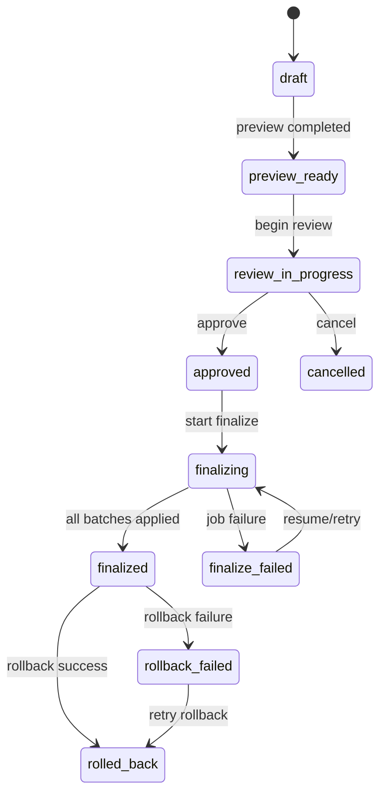

# Promotion Service Specification v1.1

## 1. Objective

Build a configurable, school-admin-controlled promotion system that evaluates end-of-year eligibility, supports review and overrides, and applies grade/class transitions safely without breaking existing app features.

## 2. Scope

1. Admin-configurable promotion criteria and rules.
2. Promotion cycle creation, preview, review, approval, finalization, and rollback.
3. Student-level decision records with evidence.
4. Grade/class placement planning with conflict handling.
5. Audit trail and activity logging.
6. Admin UI for policy and execution lifecycle.

## 3. Out of Scope (v1)

1. Fully automatic unsupervised promotions.
2. Parent self-service appeal workflow.
3. Cross-school transfers.
4. AI policy authoring.

## 4. Terminology and Definitions

### 4.1 Workflow Terms

1. **Promote**: Move student to next grade and assigned class group.
2. **Repeat**: Keep student in same grade/class group.
3. **Hold**: Pending review; no placement change.
4. **Graduate**: Student completed terminal grade; no next-grade placement in v1.
5. **Preview**: Read-only evaluation run that creates decisions but does not mutate student placements.
6. **Finalize**: Apply decisions to student placements and write compatibility fields.
7. **Rollback**: Revert a finalized cycle using stored before/after snapshots.

### 4.2 Data Terms

1. **`fee_outstanding_minor`**:
   - Integer in minor units of school currency.
   - Example: `1500` means `15.00` major units.
   - If school currency is GHS, `1500` means `GHS 15.00`.
2. **`discipline_flags`**:
   - Normalized weighted score (integer, non-negative).
   - Default formula (v1):  
     `majorIncidents*5 + minorIncidents*1 + suspensionDays*2 + unresolvedReferrals*3`
   - If discipline evidence source is missing and criterion is required, decision must be `hold` with `MISSING_DISCIPLINE_EVIDENCE`.
3. **`appliesTo.stage`**:
   - Canonical stage filter values: `"nursery" | "primary" | "jhs" | "shs" | "basic" | "other"`.
   - Engine normalizes `Grade.stage` to lowercase slug for matching.
4. **Policy Snapshot**:
   - Immutable copy of policy attached to cycle at preview creation.
   - Finalize must always use `cycle.policySnapshot`, never active policy at finalize time.

## 5. Existing System Baseline and Compatibility Guardrails

1. Keep existing Settings attendance minimum fallback behavior.
2. Keep writing `TermResult.isPromoted` for backward compatibility.
3. Keep current student status enum unchanged in v1.
4. Reuse existing class capacity and grade/class integrity constraints.
5. No changes to existing APIs consumed by current screens.

## 6. Product Decisions

1. Create dedicated page: `/admin/promotions` (Promotion Center).
2. Keep a small "Promotion Defaults" card in Settings Attendance tab.
3. Add "Promotions" nav item under Academics.
4. Promotion policy is versioned and immutable per cycle via snapshot.
5. Policy activation changes future cycles only; in-progress cycles are unaffected.

## 7. Cycle Status Model and State Machine

### 7.1 Status Values

1. `draft`
2. `preview_ready`
3. `review_in_progress`
4. `approved`
5. `finalizing`
6. `finalized`
7. `finalize_failed`
8. `cancelled`
9. `rolled_back`
10. `rollback_failed`

### 7.2 State Transitions



### 7.3 Policy vs Cycle Rule

1. A cycle must never switch its policy snapshot after preview.
2. If admin wants latest policy, create a new preview cycle.
3. Activation/deactivation of policies affects only future cycles.

## 8. Data Model (New Collections)

### 8.1 PromotionPolicy

```ts
type PromotionPolicyCriteriaKey =
  | "attendance_percent"
  | "overall_average"
  | "subjects_passed_percent"
  | "fee_outstanding_minor"
  | "discipline_flags";

interface PromotionPolicy {
  _id: ObjectId;
  schoolId: ObjectId;
  name: string;
  version: number;
  isActive: boolean;
  appliesTo: { stage?: string; gradeIds?: ObjectId[] };
  criteria: Array<{
    key: PromotionPolicyCriteriaKey;
    operator: ">=" | "<=" | ">" | "<" | "=";
    value: number;
    weight?: number;
    required?: boolean;
  }>;
  logic: "all_required_pass" | "weighted_score";
  thresholds: {
    promote: number;
    holdForReview?: number;
  };
  tieBreaker: "manual_review" | "attendance" | "overall_average";
  attendanceComputation: { treatExcusedAsPresent: boolean };
  financeHold: { enabled: boolean; maxOutstandingMinor: number };
  manualOverrideRules: { requireReason: boolean; requireApprover: boolean };
  createdBy: ObjectId;
  updatedBy: ObjectId;
  createdAt: Date;
  updatedAt: Date;
}
```

### 8.2 PromotionCycle

```ts
type PromotionCycleStatus =
  | "draft"
  | "preview_ready"
  | "review_in_progress"
  | "approved"
  | "finalizing"
  | "finalized"
  | "finalize_failed"
  | "cancelled"
  | "rolled_back"
  | "rollback_failed";

interface PromotionCycle {
  _id: ObjectId;
  schoolId: ObjectId;
  sourceAcademicPeriodId: ObjectId;
  targetAcademicPeriodId?: ObjectId | null;
  sourceYearLabel: string;
  policySnapshot: PromotionPolicy;
  status: PromotionCycleStatus;
  totals: {
    studentsEvaluated: number;
    promote: number;
    repeat: number;
    graduate: number;
    hold: number;
    overrides: number;
    errors: number;
  };
  progress?: {
    phase: "preview" | "finalize" | "rollback";
    processed: number;
    total: number;
    batchSize: number;
    cursor?: string | null;
    startedAt?: Date | null;
    updatedAt?: Date | null;
  };
  idempotencyKey: string;
  lockVersion: number;
  approvedBy?: ObjectId | null;
  approvedAt?: Date | null;
  finalizedBy?: ObjectId | null;
  finalizedAt?: Date | null;
  rollbackOfCycleId?: ObjectId | null;
  createdBy: ObjectId;
  createdAt: Date;
  updatedAt: Date;
}
```

### 8.3 PromotionDecision

```ts
type PromotionOutcome = "promote" | "repeat" | "graduate" | "hold";
type PromotionDecisionSource = "engine" | "manual_override";

interface PromotionDecision {
  _id: ObjectId;
  schoolId: ObjectId;
  cycleId: ObjectId;
  studentId: ObjectId;
  fromGradeId: ObjectId;
  fromClassGroupId: ObjectId;
  targetGradeId?: ObjectId | null;
  targetClassGroupId?: ObjectId | null;
  recommendedOutcome: PromotionOutcome;
  finalOutcome: PromotionOutcome;
  source: PromotionDecisionSource;
  reasonCodes: string[];
  reasonText?: string | null;
  evidence: {
    attendancePercent?: number | null;
    overallAverage?: number | null;
    subjectsPassedPercent?: number | null;
    feeOutstandingMinor?: number | null;
    disciplineFlags?: number | null;
  };
  conflicts: string[];
  isApplied: boolean;
  appliedAt?: Date | null;
  version: number; // optimistic concurrency for overrides
  createdBy: ObjectId;
  updatedBy: ObjectId;
  createdAt: Date;
  updatedAt: Date;
}
```

### 8.4 PromotionExecutionLog

```ts
interface PromotionExecutionLog {
  _id: ObjectId;
  schoolId: ObjectId;
  cycleId: ObjectId;
  action:
    | "preview_started"
    | "preview_completed"
    | "approved"
    | "finalize_started"
    | "student_applied"
    | "finalize_completed"
    | "finalize_failed"
    | "rollback_started"
    | "rollback_completed"
    | "rollback_failed";
  actorId: ObjectId;
  details: Record<string, unknown>;
  createdAt: Date;
}
```

### 8.5 Optional Student Fields (Additive Only)

1. `lastPromotionCycleId?: ObjectId | null`
2. `promotionHistoryCount?: number`
3. `graduation?: { graduatedAt?: Date; graduatedFromGradeId?: ObjectId }`

## 9. Rule Engine Specification

### 9.1 Evidence Sources

1. Attendance: `StudentAttendance` within source academic period.
2. Academic:
   - primary source: `TermResult`
   - fallback source: aggregate from `SubjectGrade`
3. Finance: `Invoice.totalOutstandingMinor` within source period.
4. Discipline: weighted score from discipline incident source (or missing evidence behavior).

### 9.2 Attendance Calculation

1. `attendance_percent = attended_count / total_count * 100`
2. `attended_count` includes:
   - `present`
   - `late`
   - `excused` only when `policy.attendanceComputation.treatExcusedAsPresent = true`

### 9.3 Decision Order

1. If required evidence is missing, set `hold` + reason `MISSING_EVIDENCE`.
2. If student not active at finalize time, set `hold` + `STUDENT_NOT_ACTIVE`.
3. If terminal grade and passing criteria, set `graduate`.
4. If required checks fail, set `repeat`.
5. If checks pass, set `promote`.

### 9.4 Fallback Defaults When No Active Policy Exists

1. Attendance threshold from `SchoolSettings.minimumAttendancePercent`.
2. Academic pass threshold from `GradingScale.passThreshold`.
3. If both are unavailable, preview must fail with validation error.

## 10. Placement Strategy and Conflict Codes

### 10.1 Placement Metric

1. Default algorithm: `least_loaded_active_class_in_target_grade`.
2. Load metric: active student count in class group.
3. Tie breaker order:
   - lower active student count
   - higher remaining capacity
   - class group name ascending (alphabetical)
   - class group creation time ascending

### 10.2 Manual Placement

Manual placement is supported and required for unresolved conflicts.

### 10.3 Conflict Code Catalog (Complete v1)

1. `NO_TARGET_GRADE_MAPPING`
2. `NO_CLASSGROUP_TARGET_GRADE`
3. `NO_CAPACITY_TARGET_GRADE`
4. `CLASSGROUP_INACTIVE`
5. `STUDENT_NOT_ACTIVE`
6. `STUDENT_WITHDRAWN`
7. `MISSING_ACADEMIC_EVIDENCE`
8. `MISSING_ATTENDANCE_EVIDENCE`
9. `MISSING_FINANCE_EVIDENCE`
10. `MISSING_DISCIPLINE_EVIDENCE`
11. `POLICY_REQUIRED_CRITERIA_FAILED`
12. `POLICY_SCORE_BELOW_THRESHOLD`
13. `POLICY_CONFLICT`
14. `PLACEMENT_OVERRIDE_REQUIRED`
15. `CONCURRENCY_CONFLICT`
16. `INTERNAL_ERROR`

## 11. API Contract (Admin)

All mutation endpoints require:
1. Auth: school admin.
2. `Idempotency-Key` header.
3. Standard response envelope: `{ success, data?, error?, meta? }`.

### 11.1 Policy Endpoints

1. `GET /api/admin/promotions/policies/active`
2. `POST /api/admin/promotions/policies`
3. `POST /api/admin/promotions/policies/:id/activate`

### 11.2 Cycle Endpoints

1. `POST /api/admin/promotions/cycles/preview`
2. `GET /api/admin/promotions/cycles`
3. `GET /api/admin/promotions/cycles/:cycleId`
4. `GET /api/admin/promotions/cycles/:cycleId/decisions`
5. `POST /api/admin/promotions/cycles/:cycleId/approve`
6. `POST /api/admin/promotions/cycles/:cycleId/finalize`
7. `POST /api/admin/promotions/cycles/:cycleId/rollback`

### 11.3 Decision and Placement Endpoints

1. `PATCH /api/admin/promotions/cycles/:cycleId/decisions/:studentId` (override outcome)
2. `POST /api/admin/promotions/cycles/:cycleId/placements/auto-assign`
3. `PATCH /api/admin/promotions/cycles/:cycleId/decisions/:studentId/placement` (manual placement)

### 11.4 Pagination

1. `GET /api/admin/promotions/cycles`:
   - Query: `page`, `limit`, `status`, `yearLabel`, `createdBy`, `sortBy`, `sortOrder`
   - Defaults: `page=1`, `limit=25`, `maxLimit=100`
2. `GET /api/admin/promotions/cycles/:cycleId/decisions`:
   - Query: `page`, `limit`, `outcome`, `conflict`, `gradeId`, `classGroupId`, `search`, `sortBy`, `sortOrder`
   - Defaults: `page=1`, `limit=50`, `maxLimit=200`

### 11.5 Long-Running Finalize and Rollback Behavior

1. `POST /finalize` returns `202 Accepted` quickly and moves cycle to `finalizing`.
2. Processing runs in batched background/resumable execution.
3. `GET /api/admin/promotions/cycles/:cycleId` includes live `progress`.
4. Failures move cycle to `finalize_failed` with resumable cursor.
5. Retry uses same cycle and idempotent `isApplied` decision guards.

## 12. Batch, Timeout, Retry, and Partial Failure Rules

1. Default finalize batch size: `500`.
2. Max configurable batch size: `1000`.
3. Per execution window timeout target: `5 minutes`.
4. If timeout is reached:
   - Persist progress cursor.
   - Keep cycle `finalizing`.
   - Resume next execution window.
5. If a batch fails:
   - Retry batch up to `3` attempts.
   - On repeated failure, set `finalize_failed`.
6. Already-applied decisions must be skipped on retry (`isApplied=true`).

## 13. Finalization and Rollback Semantics

### 13.1 Finalize Outcome Mapping

1. `promote`: update `Student.gradeId` and `Student.classGroupId`.
2. `repeat`: keep same grade/class.
3. `graduate`: no placement change in v1; write graduation metadata.
4. `hold`: no placement change.

### 13.2 Compatibility Writes

1. Update `TermResult.isPromoted`:
   - `promote | graduate => true`
   - `repeat | hold => false`
2. Add cycle references to student optional fields.

### 13.3 Rollback

1. Rollback must restore exact pre-finalize grade/class values from snapshot.
2. Rollback is idempotent.
3. Rollback failure sets `rollback_failed` and supports retry.

## 14. Concurrency and Edge Cases

### 14.1 Concurrency Controls

1. Cycle-level optimistic lock: `cycle.lockVersion`.
2. Decision-level optimistic lock: `decision.version`.
3. Override and placement PATCH must send current version; stale writes return `409`.

### 14.2 Edge Cases

1. Student withdrawn after preview, before finalize:
   - Convert to `hold` at finalize.
   - Add reason code `STUDENT_NOT_ACTIVE`.
2. Student added after preview:
   - Not included in existing cycle.
   - Requires new preview cycle.
3. Multiple admins editing overrides:
   - First valid write succeeds.
   - Later stale writes fail with `409 CONCURRENCY_CONFLICT`.
4. Target class reaches capacity between preview and finalize:
   - Convert affected decision to `hold`.
   - Add reason code `NO_CAPACITY_TARGET_GRADE`.

## 15. Security and Access

1. v1 authorization: `requireSchoolAdmin`.
2. All promotion mutations must be logged with actor and metadata.
3. Internal async runners must require secret header and reject public access.
4. All endpoints are school-scoped; cross-school access forbidden.

## 16. Frontend Specification

### 16.1 Route

`/admin/promotions`

### 16.2 Tabs

1. Overview
2. Policy
3. Preview
4. Review & Overrides
5. Placement
6. Finalize
7. History

### 16.3 Tab Visibility and Enabled Rules by Cycle Status

| Cycle Status | Overview | Policy | Preview | Review & Overrides | Placement | Finalize | History |
| --- | --- | --- | --- | --- | --- | --- | --- |
| No cycle selected | enabled | enabled | enabled | hidden | hidden | hidden | enabled |
| draft | enabled | enabled | enabled | hidden | hidden | hidden | enabled |
| preview_ready | enabled | enabled | enabled | enabled | enabled | hidden | enabled |
| review_in_progress | enabled | enabled | enabled | enabled | enabled | hidden | enabled |
| approved | enabled | enabled | read-only | read-only | enabled | enabled | enabled |
| finalizing | enabled | read-only | read-only | read-only | read-only | enabled (progress only) | enabled |
| finalized | enabled | read-only | read-only | read-only | read-only | read-only | enabled |
| finalize_failed | enabled | read-only | read-only | enabled | enabled | enabled (resume) | enabled |
| cancelled | enabled | enabled | enabled (new cycle) | read-only | read-only | hidden | enabled |
| rolled_back | enabled | read-only | read-only | read-only | read-only | hidden | enabled |
| rollback_failed | enabled | read-only | read-only | read-only | read-only | hidden | enabled (resume rollback action) |

### 16.4 Empty States

1. No active policy:
   - Show call-to-action to create or activate policy.
2. No cycles:
   - Show call-to-action to run first preview.
3. No decisions in filters:
   - Show "no matching students" with clear filter reset action.
4. No conflicts:
   - Show success state and allow approval/finalize path.

### 16.5 Error Handling States

1. Validation errors:
   - Field-level messages + sticky top alert.
2. Finalize failure:
   - Show failed batch summary + retry action.
3. Network errors:
   - Retry button + preserve unsaved form state.
4. Concurrency conflict (`409`):
   - Show "data changed" prompt and refresh row/cycle.

### 16.6 Loading States

1. Skeleton loaders for overview cards and tables.
2. Streaming/progress bar for preview/finalize/rollback.
3. Disable destructive actions while finalizing/rolling back.
4. Poll cycle progress every `3-5` seconds during long-running operations.

### 16.7 Existing UI Touchpoints

1. Add "Open Promotion Center" shortcut in Settings Attendance tab.
2. Add "Promotions" item in Academics sidebar section.
3. Add promotion history panel in Student Relationships tab.

## 17. Migration Plan

1. Migration A: create new collections and indexes.
2. Migration B: add optional student fields and activity event extensions.
3. Migration C: lazy-seed default policy on first Promotion Center visit if none exists.
4. Migration D: backfill `TermResult.isPromoted` only for finalized cycles (no guess backfill).

## 18. Rollout Plan

1. Phase 1: preview-only backend enabled with feature flag.
2. Phase 2: pilot schools with review/override enabled.
3. Phase 3: finalize/rollback enabled for pilot.
4. Phase 4: general availability.
5. Phase 5: optional advanced approvals and parent notifications.

## 19. Testing Strategy

1. Unit tests:
   - criteria evaluation
   - evidence calculators
   - placement selector and tie-breaks
2. Integration tests:
   - lifecycle: preview -> review -> approve -> finalize -> rollback
   - pagination and filters
   - idempotency/resume after failures
3. UI tests:
   - status-driven tab visibility
   - empty/error/loading states
   - override concurrency handling
4. Regression tests:
   - students, reports, fees, attendance flows unchanged
5. Performance tests:
   - 5,000+ students
   - finalize resume behavior

## 20. Observability and Notification Hooks

### 20.1 Logs and Metrics

1. Structured log fields: `schoolId`, `cycleId`, `studentId`, `status`, `action`, `durationMs`.
2. Metrics:
   - preview duration
   - finalize duration
   - finalize retry count
   - conflict ratio
   - rollback count

### 20.2 Notification Hooks (Optional but Recommended)

1. `promotion.cycle.preview_ready`
2. `promotion.cycle.approved`
3. `promotion.cycle.finalize_started`
4. `promotion.cycle.finalized`
5. `promotion.cycle.finalize_failed`
6. `promotion.cycle.rolled_back`
7. `promotion.cycle.rollback_failed`

## 21. Acceptance Criteria

1. Admin can create/activate policy versions.
2. Admin can run preview with no placement mutations.
3. Admin can override decisions with mandatory reason.
4. Admin can manually place students when needed.
5. Finalize runs asynchronously with progress and retry support.
6. Rollback restores pre-finalize placements.
7. Existing modules and API consumers continue working unchanged.

## 22. API Payload Examples

### 22.1 Preview Request

```json
{
  "sourceAcademicPeriodId": "65f4a36c91d58f103c8e1f01",
  "targetAcademicPeriodId": "66f4a36c91d58f103c8e1f99",
  "policyId": "6701e6d77a1f7a2b60901111",
  "scope": {
    "gradeIds": ["65f4a36c91d58f103c8e1a10"],
    "classGroupIds": []
  }
}
```

### 22.2 Preview Response

```json
{
  "success": true,
  "data": {
    "cycleId": "6702b8c87a1f7a2b60909999",
    "status": "preview_ready",
    "totals": {
      "studentsEvaluated": 312,
      "promote": 244,
      "repeat": 34,
      "graduate": 12,
      "hold": 22,
      "overrides": 0,
      "errors": 0
    }
  }
}
```

### 22.3 Manual Placement PATCH

```json
{
  "targetGradeId": "65f4a36c91d58f103c8e1a20",
  "targetClassGroupId": "65f4a36c91d58f103c8e1b31",
  "reasonText": "Parent requested same homeroom teacher continuity",
  "version": 3
}
```

### 22.4 Finalize Start Response

```json
{
  "success": true,
  "data": {
    "cycleId": "6702b8c87a1f7a2b60909999",
    "status": "finalizing",
    "progress": {
      "phase": "finalize",
      "processed": 0,
      "total": 312,
      "batchSize": 500
    }
  }
}
```

### 22.5 Finalize Failed Response (Example)

```json
{
  "success": false,
  "error": "Batch failed after 3 retries",
  "data": {
    "cycleId": "6702b8c87a1f7a2b60909999",
    "status": "finalize_failed",
    "progress": {
      "phase": "finalize",
      "processed": 200,
      "total": 312,
      "cursor": "200"
    }
  }
}
```

## 23. Appendix: Sample PromotionPolicy JSON

```json
{
  "name": "Default End-of-Year Policy",
  "version": 1,
  "isActive": true,
  "appliesTo": {
    "stage": "basic",
    "gradeIds": []
  },
  "criteria": [
    {
      "key": "attendance_percent",
      "operator": ">=",
      "value": 75,
      "required": true
    },
    {
      "key": "overall_average",
      "operator": ">=",
      "value": 50,
      "required": true
    },
    {
      "key": "fee_outstanding_minor",
      "operator": "<=",
      "value": 0,
      "required": false
    }
  ],
  "logic": "all_required_pass",
  "thresholds": {
    "promote": 100,
    "holdForReview": 60
  },
  "tieBreaker": "overall_average",
  "attendanceComputation": {
    "treatExcusedAsPresent": true
  },
  "financeHold": {
    "enabled": false,
    "maxOutstandingMinor": 0
  },
  "manualOverrideRules": {
    "requireReason": true,
    "requireApprover": false
  }
}
```
