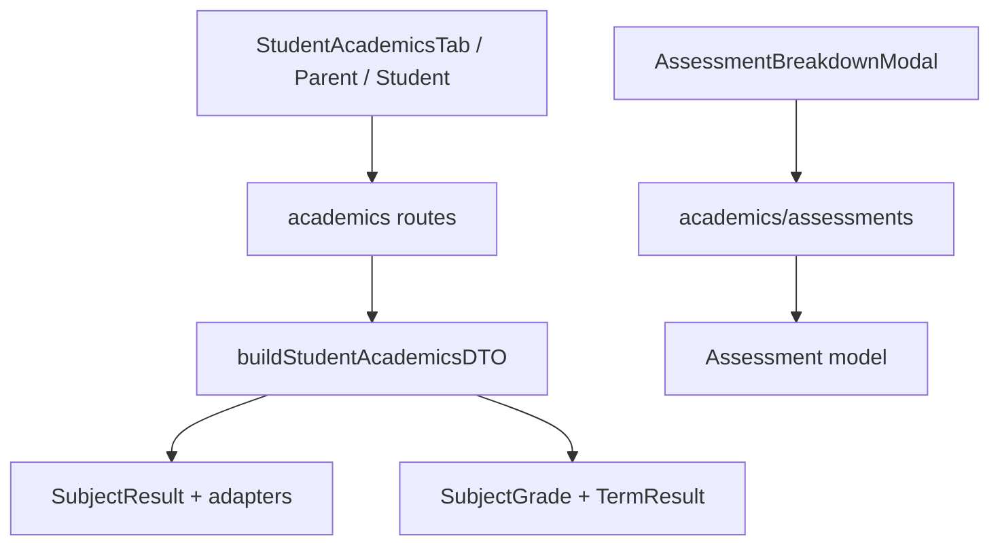

# Student Academic Profile — Discovery Map

**Spec:** `STUDENT_ACADEMIC_PROFILE_SPEC.md`  
**Date:** 2026-05-30 (discovery); updated after Slices 0–21 complete  
**Completion summary:** `docs/STUDENT_ACADEMIC_PROFILE_IMPLEMENTATION_COMPLETE.md`

---

## 1. Executive Finding (historical → current)

**At Slice 0:** Academics used a legacy-shaped `StudentAcademicsDTO` via `buildStudentAcademicsDTO`.

**Now (Slices 0–21 complete):** `src/lib/academics/profile/*`, `StudentAcademicProfileDTO`, profile APIs, and migrated admin/parent/student UIs are in place. Legacy DTO remains only for explicit compat paths — see `docs/STUDENT_ACADEMIC_PROFILE_LEGACY_DTO_DEPRECATION.md`.

---

## 2. File Inventory (Current)

### 2.1 Types

| File | Role |
|------|------|
| `src/types/admin/student-academics.ts` | Canonical **old** `StudentAcademicsDTO` and row types |
| `src/types/academics/assessment-engine.ts` | Engine enums (`SubjectResult`, report statuses, components) |
| `src/types/academics/report-card-view.ts` | Report card **view** DTO (admin/parent card viewer; not student profile) |

**Implemented:** `src/types/academics/student-academic-profile.ts`

### 2.2 Builders / compatibility

| File | Role |
|------|------|
| `src/lib/academics/buildStudentAcademicsDTO.ts` | Main legacy+engine **merge** builder (~670 lines) |
| `src/lib/academics/compatibility/load-subject-results.ts` | Loads `SubjectResult` by period |
| `src/lib/academics/compatibility/subject-result-adapters.ts` | Maps engine components → CA/exam % for legacy UI |
| `src/lib/academics/calculateGrades.ts` | Trend helper |
| `src/lib/academics/calculateRiskLevel.ts` | Risk from averages |
| `src/lib/academics/calculateClassAverages.ts` | Class averages for insights/charts |

### 2.3 Reporting engine (reuse for Slices 3, 5, 8)

| File | Role |
|------|------|
| `src/lib/academics/reporting/load-student-report-card.ts` | `findStudentReportCard`, `listReleasedStudentReportCards` |
| `src/lib/academics/reporting/build-student-report-card-view.ts` | Snapshot → `ReportCardViewData` |
| `src/lib/academics/reporting/resolve-student-report-card-view.ts` | Resolve view for admin/parent |
| `src/lib/academics/reporting/build-attendance-snapshot.ts` | Homeroom → snapshot for runs |
| `src/models/StudentReportCard.ts` | Released/compiled snapshots |
| `src/models/ReportAttendanceSnapshot.ts` | Attendance snapshot model |
| `src/models/SubjectResult.ts` | Live/submitted subject results |

### 2.4 API routes (current academics)

| Route | Builder | Query params |
|-------|---------|--------------|
| `GET /api/admin/students/[id]/academics` | `buildStudentAcademicsDTO` | `termId` or `periodId` |
| `GET /api/admin/students/[id]/academics/assessments` | Legacy `Assessment` model | `subjectId`, `termId` |
| `GET /api/admin/students/[id]/academics/ai-insights` | `buildStudentAcademicsDTO` + Leo | period via body/query |
| `GET /api/parent/wards/[id]/academics` | `buildStudentAcademicsDTO` | `termId` / `periodId` |
| `GET /api/student/results` | `buildStudentAcademicsDTO` | period |
| `GET /api/parent/reports/download` | Also uses `buildStudentAcademicsDTO` for legacy PDF path | — |

**Implemented (profile APIs):**

- `GET /api/admin/students/[id]/academic-profile` (+ breakdown)
- `GET /api/parent/wards/[id]/academic-profile` (+ breakdown)
- `GET /api/student/academic-profile` (+ breakdown)

Legacy routes (`.../academics`, `/api/student/results`) remain with deprecation headers.

### 2.5 Hooks

| File | Consumers |
|------|-----------|
| `src/hooks/admin/useStudentAcademicProfile.ts` | `StudentAcademicsTab` (primary) |
| `src/hooks/admin/useStudentAcademics.ts` | `StudentAcademicsTab` (conditional legacy fallback) |
| `src/hooks/parent/useParentAcademicProfile.ts` | `ParentWardAcademicsTab` |
| `src/hooks/student/useStudentAcademicProfile.ts` | `StudentResultsProfileClient` |
| `src/hooks/parent/useParentAcademics.ts` | Parent multi-ward list (still custom aggregation) |
| `src/hooks/parent/useWardAcademics.ts` | Ward overview (profile-mapped compat API) |

### 2.6 Admin UI (student detail → Academics tab)

| Component | Depends on |
|-----------|------------|
| `StudentAcademicsTab.tsx` | `useStudentAcademicsData`, `?termId` URL |
| `TermSelector.tsx` | `academics.term[]` — no status badges |
| `AcademicSummaryCards.tsx` | `summary`, no attendance/report status cards |
| `SubjectPerformanceTable.tsx` | Fixed CA/exam/`gradeLetter` columns |
| `AssessmentBreakdownModal.tsx` | `/academics/assessments` (legacy `Assessment`) |
| `TeacherCommentsSection.tsx` | Live `TeacherComment` list |
| `OverallPerformanceTrend.tsx` | `multiTermHistory` |
| `SubjectPerformanceOverTime.tsx` | `subjectHistory` |
| `SubjectStrengthsOverview.tsx` | strongest/weakest |
| `AIInsightsPanel.tsx` | `/academics/ai-insights` |
| `AcademicsDataSourceNotice.tsx` | `dataSource` on old DTO |

**Missing (spec §20):** `ReportStatusPanel`, `AttendanceSummaryPanel`, `AcademicEvidenceSummary`, `ReportCardActionsPanel`, `OfficialStatusBadge`, `ScoreComponentChips`

### 2.7 Parent / student surfaces

| Surface | Data path |
|---------|-----------|
| `src/app/(app)/parent/academics/page.tsx` | `useParentAcademics` → ward academics API |
| `src/app/(app)/parent/reports/page.tsx` | Report cards (engine) |
| `src/app/(app)/student/results/page.tsx` | `/api/student/results` |
| `src/lib/insights/buildStudentInsightsDTO.ts` | Separate insights DTO; still CA/exam oriented |

### 2.8 AI insights (parallel path)

- Admin tab: `AIInsightsPanel` → `/api/admin/students/[id]/academics/ai-insights`
- Prompt built from `buildStudentAcademicsDTO` output (legacy fields)
- `buildStudentInsightsDTO.ts` used elsewhere (Insights tab); not wired to `StudentReportCard` / evidence counts

---

## 3. Data Flow (Today)



**Not in academics DTO today:**

- `StudentReportCard` snapshot (released official data)
- `ReportCardRun` readiness
- `ReportAttendanceSnapshot` / homeroom live attendance in profile
- `AssessmentItem` / `AssessmentScore` evidence in breakdown
- Role-based visibility / provisional vs official flags per period

---

## 4. Old DTO Fields — Preserve During Migration

Keep `StudentAcademicsDTO` and these consumers working until Slice 21:

### 4.1 Core identity / period

- `studentId`, `schoolLevel`, `selectedTermId`, `selectedTermLabel`
- `term[]` with `termId`, `label`, `averageScore`, `classPosition`, `totalSubjects`, `performanceTier`

### 4.2 Summary (admin tab cards + trends)

- `summary.overallAverage`, `classPosition`, `totalStudents`, `performanceTier`, `trend`, `trendDelta`
- `riskLevel`, `strongestSubject`, `weakestSubject`
- `multiTermHistory`, `subjectHistory`, `classAverages`

### 4.3 Subject rows (table)

- `subjects[]`: `caPercentage`, `examPercentage`, `totalScore`, `gradeLetter`, `gradePoint`, `isPassed`
- Bridge fields from engine: derived via `deriveLegacyComponentPercentages` in adapters

### 4.4 Comments

- `comments[]`: `TeacherCommentDTO` shape

### 4.5 Migration hints (already added)

- `dataSource?: "assessment_engine" | "legacy" | "mixed"`
- `dataSourceNotes?: string[]`

### 4.6 Do NOT remove yet

Used by: admin tab, parent ward API, student results, parent report download (partial), AI insights route, mobile contract doc `docs/PARENT_MOBILE_API_CONTRACT.md`.

---

## 5. Gap Map: Old DTO → New Profile DTO (Spec §7)

| New concept | Old equivalent | Gap |
|-------------|----------------|-----|
| `recordStatus` / `reportStatus` | None | Add from `StudentReportCard` + `ReportCardRun` |
| `dataSource: report_snapshot` | `assessment_engine` only | Snapshot not first priority |
| `subjectResults[].components[]` | CA/exam only | Need dynamic components in UI |
| `gradeLabel` | `gradeLetter` | Rename in new DTO; map legacy |
| `attendance` | None in academics DTO | `StudentAttendance` + snapshot |
| `assessmentEvidenceSummary` | None | Count items from engine |
| `reportCard.canDownload` | Parent reports routes | Wire in profile builder |
| `permissions` / `visibilityMode` | None | Per-role filtering |
| `periods[].status`, `isOfficial` | Plain term list | Period timeline upgrade |
| `summary.projectedAverage` vs `finalAverage` | Single `overallAverage` | Split by release state |
| Breakdown evidence | Legacy `Assessment` | New breakdown API |

---

## 6. Assessment Engine Assets Ready for Reuse

Already implemented (from assessment engine work):

- Models: `SubjectResult`, `AssessmentItem`, `AssessmentScore`, `StudentReportCard`, `ReportCardRun`, `ReportAttendanceSnapshot`
- `findStudentReportCard` / `build-student-report-card-view` for snapshot reads
- `subject-result-adapters` for legacy CA/exam projection (keep for Slice 6 only)
- Parent report card list/download using engine snapshots

Profile builder should **call** these, not duplicate report-card view building unless sharing helpers makes sense.

---

## 7. Slice Dependency Order (Confirmed)

```
0 Discovery (this doc)
1 Types
2 Builder shell
3 From StudentReportCard
4 From SubjectResult
5 Attendance
6 Legacy fallback
7 Admin API
8 Breakdown API
9 Hook
10–18 UI + Leo
19 Parent
20 Student
21 Deprecation
```

---

## 8. Risks / Anti-Drift Notes

1. **Do not extend** `buildStudentAcademicsDTO` with full profile logic — spec requires parallel `profile/` builder. See **`docs/STUDENT_ACADEMIC_PROFILE_LEGACY_DTO_DEPRECATION.md`** (Slice 21) for consumer inventory and compat wrappers.
2. **Do not** switch admin tab to new API until Slice 9+ hook exists; use new route first behind hook.
3. **Breakdown** must move from `Assessment` model to `AssessmentItem`/`AssessmentScore` (Slice 8/14).
4. **Parent download** route uses old builder — Slice 21 must not break; test when switching.
5. URL param: keep `termId` compatibility when adding `periodId` (admin route already accepts both).

---

## 9. Slice 0 Acceptance Checklist

- [x] Current files and dependencies reported
- [x] Old DTO fields to preserve identified
- [x] No functional code changes

## 10. Implementation status (Slices 1–21)

- [x] Profile types, builder, permissions, empty shell
- [x] Report card / subject results / attendance / legacy fallback layers
- [x] Admin + parent + student profile APIs and breakdown
- [x] Admin tab, parent ward academics, student results UI
- [x] Legacy DTO deprecation (`docs/STUDENT_ACADEMIC_PROFILE_LEGACY_DTO_DEPRECATION.md`)
- [x] 87 unit tests (`tests/student-academic-profile.*.test.ts`)
- [x] Anti-drift rules in `AGENTS.md` (Slice 22)

**Optional follow-ups:** parent multi-ward `/api/parent/academics`, legacy PDF-only download path removal — see implementation complete doc.
